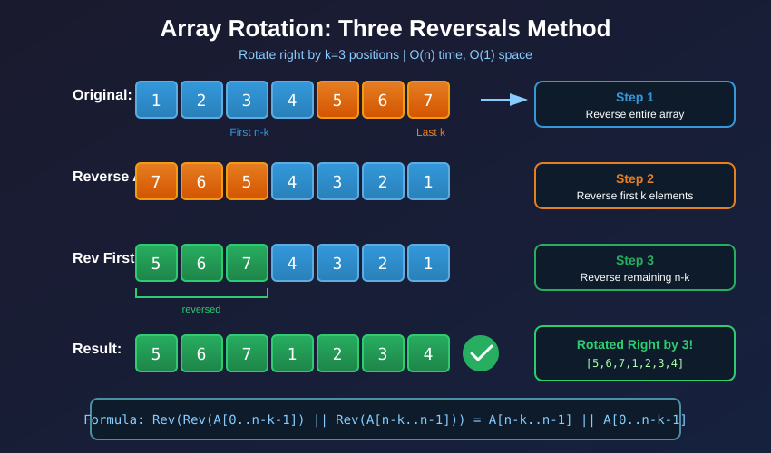

# Array / String — Technique Hub

Contiguous, index-addressable data. The most technique-rich structure — which is why "array problem" tells you almost nothing until you spot the *move*. This page maps to those moves.

## Structure facts

- O(1) random access; contiguous ranges are cheap to reason about.
- **Sorted?** unlocks binary search and two-pointer convergence.
- Frequency/seen questions → pair with a hashmap or fixed-size count array.

## Techniques used on arrays/strings

| Technique | Recognition signal | Doc |
|---|---|---|
| **Two pointers** | Sorted-pair search, in-place compaction, converge from ends | [techniques/two_pointer](../techniques/two_pointer.md) |
| **Sliding window** | Contiguous subarray/substring with a constraint | [techniques/sliding_window](../techniques/sliding_window.md) |
| **Prefix sum (+ hashmap)** | Range sums, "subarrays summing to k" | [techniques/prefix_sum](../techniques/prefix_sum.md) |
| **Binary search** | Sorted data, or "smallest x that works" | [techniques/binary_search](../techniques/binary_search.md) |
| **Monotonic stack** | Nearest greater/smaller element | [techniques/monotonic_stack](../techniques/monotonic_stack.md) |

## Deciding fast

| Question | Technique |
|---|---|
| Pair/triple summing to target in **sorted** array? | two pointers |
| Longest/shortest contiguous window with a rule? | sliding window |
| Count/among subarrays with sum k? | prefix sum + hashmap |
| Find first index satisfying a monotonic condition? | binary search (min boundary) |
| Next greater / span / histogram? | monotonic stack |
| Shift/rotate elements by k, in place? | three reversals (below) |

## In-place rotation — the three-reversals trick

Rotating right by `k` looks like it needs a second array or `k` passes. It doesn't: **reverse the
whole array, then reverse each of the two pieces.** O(n) time, O(1) space, three calls to the same
helper.

Two things to get right: take `k %= n` first (rotating by more than the length wraps), and note the
split lands at `k`, not `n-k`, once the array is already reversed.

## Representative problems

167 Two Sum II, 15 3Sum, 424 Longest Repeating Char, 567 Permutation in String, 560 Subarray Sum=K, 238 Product Except Self, 33 Search Rotated, 875 Koko, 739 Daily Temperatures, 84 Largest Rectangle.
