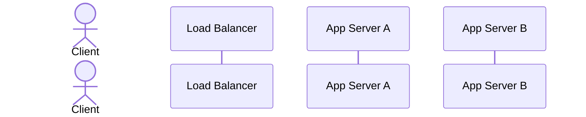

# 🧱 Component: Load Balancer

> **Scaffolded Jul 29, 2026 — lane ② (blocks & probes).** The cold hit from the Jul 26 rate-limiter
> mock. You fill this; filling it *is* the rep.
>
> **Restructured Jul 29** from a 5-column table into a ladder. The algorithms are mostly *successive
> repairs*, not parallel options — each one exists because the previous one broke. The `→ Which is why`
> line is the load-bearing part; a table had nowhere to put it.

## 🎯 1-Sentence Metaphor
> ✅ **Learner-derived Aug 6, 2026** (one word sharpened: *host*, not *server* — "server" already means a
> backend in this domain, so it can't also name the LB).

**A load balancer is the host at a busy restaurant** — standing at the single entrance, distributing
arriving **diners (requests)** across the open **tables (backend servers)** so none is overwhelmed while
others sit empty. The tension the rest of this note lives on rides right on top: the host can seat you
*wherever there's room* (**load-aware** — round robin, least connections) **or** always put you in your
regular waiter's section (**affinity** — IP hash, sticky sessions), but not both for free.

## 🧠 Underlying DSA Connection
* **Core Data Structure**:
* **Algorithmic Complexity**: pick-a-backend:
* **Data Flow Pattern**:

## 📋 Core Architectural Configurations

### 1. Where it sits (L4 vs L7)
> ⚠️ **Taught Aug 1, not derived** — the learner flagged missing networking fundamentals partway through,
> so this was explained rather than pulled out of them. **Taught, not tested.** Prerequisite card scheduled:
> `concepts/networking_basics.md`.

**The prerequisite, in one picture.** Your data is wrapped in nested envelopes:

```
┌─ L3 (IP) ──────── to: 93.184.216.34 ─────────────────────┐
│ ┌─ L4 (TCP) ───── to: port 443 ──────────────────────┐   │
│ │  ┌─ L7 (HTTP) ── GET /home, Cookie: route=srv2 ─┐  │   │
│ │  └────────────────────────────────────────────────┘  │   │
│ └────────────────────────────────────────────────────┘   │
└──────────────────────────────────────────────────────────┘
```

* **L3 / IP — *which machine*.** The street address.
* **L4 / TCP — *which program on it*, plus reliable delivery.** The port is the apartment number (443 = web
  server, 5432 = Postgres). TCP is also what makes a "connection" exist — it splits data into packets,
  numbers them, and reassembles them in order.
* **L7 / HTTP — *the message itself*.** URLs, headers, cookies.

**"L4 LB" and "L7 LB" just mean how many envelopes it opens.**

* **L4 (transport)**: reads source/destination IP and port, forwards the packets, never looks inside. It
  doesn't know or care whether the payload is HTTP.
* **L7 (application)**: must **terminate the connection** — accept the TCP connection itself, wait for
  enough packets, reassemble the HTTP request, parse the headers — and only then open a **second, separate
  connection** to the chosen backend and relay it.

**The mental image: L4 is a mail sorter reading the envelope. L7 opens the letter and reads it.**
Every trade below falls out of that one difference:

| | **L4** | **L7** |
|---|---|---|
| Sees | IP + port | URL, headers, cookies, method |
| Connections | one flow, forwarded | **two** — client↔LB, LB↔server |
| TLS | passes encrypted bytes through untouched | must **decrypt** to read anything |
| Cost | very fast, minimal CPU | real per-request work |
| Unlocks | nothing content-based | **cookie stickiness**, path routing (`/api`→svc A), header routing, compression, rewriting |

* **Which one can do the thing you need**: **anything that depends on request *content* requires L7.**
  The sharpest instance is in §3 — **sticky sessions require L7**, because a cookie is written on the letter
  and an L4 device never opens the envelope. Conversely, if you're balancing a non-HTTP protocol, or you want
  the lowest possible added latency and TLS passed straight through, L4 is the right answer.

---

## 2. Balancing algorithms — the ladder

> Read top to bottom. Each one is a repair of the one above it, except IP hash, which
> solves a different problem entirely.

**Vocabulary.** The family is called **load balancing algorithms** — also *server selection*, *routing
strategy*, or *distribution algorithm*. It splits in two, and the split is why this ladder has a
discontinuity at IP hash:

| Family | Members | Goal | Accepts |
|---|---|---|---|
| **Load-aware distribution** | round robin · least connections | spread work evenly; any server will do | no affinity — a client can land anywhere |
| **Affinity / key-based routing** | IP hash · consistent hashing | same key always reaches the same server | **load-blindness** — that's the price, not a bug |

**Say it this way in an interview:** *the first family optimizes throughput; the second optimizes cache
locality and session continuity.* IP hash is therefore not a better round robin — it is a different
question being answered.

### Round robin
* **Picks by:** picks sequentially around and around
* **Assumes:** assumes that all requests are the same size
* **Breaks when:** breaks when one request hangs for a long time
* **Tradeoff:** holds no per-server state
  * *The sharpening:* it does keep a rotation index — but that's a fact about the LB's **own
    behaviour** ("I dealt to server 2 last") and cannot disagree with reality. Contrast with a
    connection count, which is a **claim about the world** and can go stale.
* **→ Which is why:** least connections exists.

### Least connections
* **Picks by:** it finds the server with the min open sockets
* **Assumes:** assumes that the smallest connections have the smallest loads
* **Breaks when:** breaks when server A with many open connections but idle and server B with only a
  few open connections but overloaded due to workload. The algorithm here chooses B.
  * *Second break — the stale counter:* a connection that dies without the LB observing it never gets
    decremented. That server's count sits permanently inflated, so it permanently loses the `min`
    comparison and is **starved of traffic while healthy and idle.**
* **Tradeoff:** It also gives load balancer a state by adding a Counter to help it find the least
  connections
* **→ Which is why:** *(does anything repair this one? or is the next algorithm answering a different
  question entirely?)*

### IP hash
* **Picks by:** picks the server based on the client hash, so same client always gets same server
* **Assumes:** assumes clients are uniform in number and weight
* **Breaks when:** breaks when we add a server and then the client loses what was in the RAM in their original server. We can also have key skew when the assumption breaks
* **Tradeoff:** does not check load on servers to get the same server guarantee
* **The different problem it solves:** guarantee same server per IP
* **→ Which is why:** consistent hashing exists.

**Banked from the Jul 29 session — the arithmetic that motivates the next rung:**

`hash(client_ip) % 3`, then add a fourth server so it becomes `% 4`. A client keeps its server only
when `h % 3 == h % 4`. Over the repeating period of 12:

| h | h%3 | h%4 | same? |
|---|---|---|---|
| 0 | 0 | 0 | ✓ |
| 1 | 1 | 1 | ✓ |
| 2 | 2 | 2 | ✓ |
| 3–11 | | | ✗ |

**3 of 12 keep their server → 75% of all clients get remapped** by adding one machine to a
three-server pool. Every one of them loses whatever was in local RAM.

**And the culprit is `% N`, not hashing.** The modulus bakes "how many servers exist" into every
key's destination, so changing N rewrites the whole mapping.

### Consistent hashing
> ⚠️ **Written up by the coach Jul 29, not learner-derived** — the ring rule and its consequence were
> supplied at the end of a session that overran badly. Treat every cell below as **taught, not tested.**
> The measurement is the rated blind sprint in the Aug 3 week, not the Jul 30 quiz.

* **Picks by:** hash the **servers** into the same fixed space as the clients (say 0–999), then a key
  goes to the **next server upward, wrapping** at the top. `% N` is gone — nothing counts the servers.
* **Assumes:** the servers' hashes land reasonably spread around the ring.
* **Breaks when:** that spread doesn't happen. With few servers, hashes clump by luck and the arcs come
  out wildly unequal — the server below a big gap owns a big share of the keyspace and becomes a hot
  spot. *(Fix: **virtual nodes** — hash each physical server to many points on the ring, e.g. 150
  each, so the arcs average out. Not covered Jul 29.)*
* **Tradeoff:** more machinery than `% N` — a sorted structure of ring positions and a successor
  lookup (binary search, `O(log N)`) instead of one modulo. You buy stability under membership change
  and pay in complexity. Still load-blind, exactly like IP hash.
* **What fraction of keys move when a server is added?** **~1/N**, and **exactly one existing server is
  affected** — the new node's successor, which gives up the arc between itself and the new node.
  Nobody else notices.

**The trace that produced that (servers 120 / 480 / 850, then add 700):**

| Server | Owns before | Owns after | Change |
|---|---|---|---|
| **120** | 851–999, 0–120 *(wraps)* | same | untouched |
| **480** | 121–480 | same | untouched |
| **700** | — | 481–700 | *new* |
| **850** | 481–850 | 701–850 | lost 481–700 |

**220 of 1000 keys move ≈ 22%** (against 1/4 = 25% expected for N=4) — versus **75%** under `% N`.

* **Why *next-upward* and not "closest"** *(learner's first instinct — deterministic and count-free, so
  it did meet the stated constraints)*: under next-upward a new node carves its arc out of **one**
  neighbour. Under closest it takes from **two**, and the clean one-neighbour bound disappears.

### Virtual nodes *(the repair for consistent hashing's own weakness)*
> ⚠️ **Taught Aug 1, not derived.** The learner named "virtual nodes" but not the mechanism, which was
> supplied. What *was* theirs: correctly segmenting the 120/130/140 ring into its three arcs, including
> the wrap. Same status as consistent hashing above — **taught, not tested.**

**The problem it repairs.** Consistent hashing killed the 75% remap, but *where* a server lands on the ring
is the hash function's choice, not yours. Three servers hashing to **120, 130, 140** is not exotic — with few
servers, clumping is typical, not unlucky:

| Server | Owns | Share |
|---|---|---|
| **120** | `141…999, 0…120` *(wraps)* | **98%** 🔥 |
| 130 | `121…130` | 1% |
| 140 | `131…140` | 1% |

A server owns the arc *below* it, so 120 sits at the top of the 980-wide gap around the back.

**The mechanism: don't hash a server once — hash it many times under different labels.**

```
"ServerA#0" → 45     "ServerA#1" → 310    "ServerA#2" → 620    "ServerA#3" → 880
```

Four different strings ⟹ four unrelated positions, all pointing at **one physical machine**. The ring just
records which server each point belongs to. **Lookup is completely unchanged** — a key walks upward, hits a
point, and the point names its server.

**Why it works:** 3 random points can land 10 apart by bad luck; 450 random points cannot *all* clump. Long
and short arcs average out across the many copies each server owns. Production uses **~100–200 virtual nodes
per server**.

**Cost — and the load-bearing distinction is *when* it's paid:**

| | Cost |
|---|---|
| Build the ring | `N × V` hashes, **once** (and again only on join/leave) |
| Memory | `N × V` ring entries — 10 servers × 150 = 1500, nothing |
| **Per request** | **one hash + one binary search, `O(log(N × V))`** |

`N` = physical servers, `V` = virtual nodes each. The `log` goes from `log 10` (~4 comparisons) to `log 1500`
(~11) — irrelevant next to a network hop. **The 150× is setup cost, not request cost**, which is the whole
reason this is affordable.

---

### 3. Sticky sessions
> ✅ **Learner-derived Aug 1**, apart from the stateless-servers conclusion, which was asked for and taught.
> Both failure modes below (IP changes · NAT collision) and the cookie mechanism came from the learner.

* **The problem.** Round robin sends a logged-in user to a server that never created their session. The app
  sees no valid session, makes an empty one, and bounces them to the login page. Symptom: **random logouts
  every few clicks.**

* **First instinct — IP hash / consistent hashing.** Correct family (affinity), wrong identity. Two mirror
  failures, and they're the ones an interviewer probes:

  | Failure | What happens |
  |---|---|
  | **IP changes** — phone leaves wifi for cellular | new IP ⟹ new hash ⟹ new server ⟹ logged out anyway |
  | **IPs collide** — 2,000 staff behind one corporate NAT | one IP, one hash, **all 2,000 on one server** (this *is* the key-skew row above) |

  **The lesson:** IP is borrowed from the network layer, and the network layer promises neither stability
  nor uniqueness.

* **What it is.** The LB sets **its own cookie** on the first response (nginx `route=srv2`, AWS ALB
  `AWSALB`) naming the target server; every later request carries it back and the LB routes on it.
  **The identity is issued by the LB, not borrowed** — so it survives an IP change and doesn't collapse
  under NAT.

* **What it buys.** Session-affinity that actually holds, and local in-RAM session state keeps working.

* **What it costs.**
  * **Server dies ⟹ its sessions die with it.** Everyone stuck to it is logged out at once.
  * **Load skews over time.** Sessions accumulate on long-lived servers, and a **newly added server gets no
    existing traffic** — scaling out stops giving immediate relief.
  * **Requires an L7 LB**, since reading a cookie means parsing HTTP (see §1).

* **⭐ The senior answer: sticky sessions are a workaround. Make the servers stateless instead.**
  The LB was never the problem — the problem is that session state lives in one server's RAM, which makes
  machines **non-interchangeable**, and non-interchangeable machines are what force affinity. Move session
  state to a shared store (Redis) and any server can serve any request. Stickiness becomes unnecessary and
  you get everything back: round robin, even load, instant benefit from scale-out, no session loss on death.

  **Same shape as the rate limiter derivation** — three servers each with a local counter → *"put the counter
  where all three can see it."* Identical move, identical answer. **Local state is the disease; affinity is
  the painkiller.**

  *(Second option, not yet covered: put the session data **in** the signed cookie itself — JWT-style — so
  there's no lookup at all. Owed to a later session.)*

## 📊 Quick-reference (fill last — one line per cell, for scanning mid-interview)

| Algorithm | Picks by | Key weakness | Reach for it when |
|---|---|---|---|
| Round robin | | | |
| Least connections | | | |
| IP hash | | | |
| Consistent hashing | | | |

## 🔗 The rate-limit interaction (the reason this note exists)

> ✅ **Learner-derived Aug 6, 2026.** The whole table, both threshold designs, and the coupling punchline
> came from the learner. One reset needed early — separating *rate limiting* (count a user's requests vs a
> fixed threshold) from *load balancing* (spread work) — after which it derived cleanly.

You designed a per-instance in-memory rate-limit fallback for when Redis is down. **The fallback = each
instance independently enforces the *full* policy it knows (10/min/user)** — because with Redis down the
instances *can't coordinate*, so there's no "N" to divide by; each server just applies the limit it has.
Whether that holds depends entirely on **whether the LB concentrates a user onto one instance or scatters
them** — which is a property *of the LB algorithm*, which is why this table lives in the LB note.

| Algorithm | User's requests land on one instance? | Per-instance fallback correct? | Effective limit vs intended |
|---|---|---|---|
| Round robin | ❌ scatters evenly across all N | ❌ **leaks** | **10 × N** |
| Least connections | ❌ load-aware, still scatters | ❌ **leaks** | **≈ 10 × N** |
| IP hash | ✅ same client → same server | ✅ correct | 10 (= intended) |
| Consistent hashing | ✅ same key → same server | ✅ correct | 10 (= intended) |
| Sticky sessions | ✅ LB cookie pins the user | ✅ correct | 10 (= intended) |

**The two threshold designs are mirror images — each is correct under exactly one routing family:**

| Per-instance threshold | Correct under… | Breaks under… |
|---|---|---|
| **Full limit** (10) | affinity (IP hash · consistent hashing · sticky) — user concentrates on one counter | scatter (RR · least-conn) → **leaks to 10 × N** |
| **total / N** (10/N) | scatter — the N partial counts sum back to 10 | affinity → **over-restricts to 10 ÷ N** |

* **Conclusion — what routing does the (full-limit) fallback require?** **Affinity routing** — IP hash,
  consistent hashing, or sticky sessions. A local counter is only honest when it sees *all* of a user's
  traffic, and only affinity guarantees that concentration.
* **And what does that requirement cost you elsewhere?** **Load-blindness.** The affinity family routes by
  key and never looks at server load (§2), so you give up even distribution and inherit **key-skew hot
  spots** — the NAT-collision row (2,000 users → one server) is now also 2,000 users on *one rate-limit
  counter*.
* **⭐ The coupling punchline:** the rate-limiter's fallback design and the LB algorithm are **not
  independent choices.** Full-limit counter ⟹ must use affinity ⟹ must accept load-blindness. Naming that
  chain unprompted is the senior tell. *(The real fix, same as everywhere else in this note: don't fall
  back to local counters — put the counter in a shared store so any routing works. Local state is the
  disease; affinity is the painkiller.)*

## 🚨 Operational Bottlenecks & Failure Modes
* **Failure Mode 1 — a backend dies but the LB keeps routing to it.** *(Not yet derived — owed. The
  mitigation is **active health checks**: the LB probes each backend on an interval and pulls a
  non-responsive one from rotation. The open question for that session: detection speed vs false
  positives — see Likely Questions "how fast?".)*
* **Failure Mode 2 — a backend is slow but not dead** (see Likely Questions). *(Owed.)*
* **The LB itself is a single point of failure — how is it made not one?**
  > ⚠️ **Taught Aug 6, 2026, not derived** — the learner reached for leader-follower correctly (the
  > active-passive shape *is* leader-follower), but the failover *mechanism* (floating IP + ARP) was
  > supplied. **Taught, not tested** — owed a blind sprint. Recognition of the pattern was theirs.

  **Run two LBs, active-passive (= leader-follower): one serves all traffic, a standby sits idle.** The
  hard part is *not* "run two" — it's that the client is the whole internet, hardcoded to one IP, and
  can't be told to reconnect. So **the address moves to the survivor, not the client to a new address.**

  * **Floating IP / VIP (Virtual IP).** Clients dial one IP that belongs to *neither* box permanently.
    An IP is **a claim a machine makes on the local network, not a physical property of the card** — so
    it can be reassigned. The active LB holds the claim; the standby stays quiet.
  * **Heartbeat.** The two LBs exchange a heartbeat (VRRP / keepalived). Standby stops hearing the leader
    ⟹ concludes it's dead ⟹ claims the VIP.
  * **Gratuitous ARP** (ARP = Address Resolution Protocol; maps IP → MAC, the physical card address used
    for the final LAN hop). The standby *volunteers* the new mapping unasked — "`VIP` is at **my** MAC
    now" — and every switch/router on the LAN overwrites its cache. The next packet for the VIP arrives
    at the standby. **Client dialed the same IP the whole time; only the machine behind it changed.**
  * **Why the announcement goes to the local network, not the client:** the VIP physically lives on one
    LAN, so only that segment's switches must relearn the IP→MAC binding — a fast, local update. The
    client is many hops away and has no channel to push to (and doesn't need one).

  **Chain to recall:** heartbeat lost → standby claims VIP → gratuitous ARP → switches update IP→MAC →
  traffic reroutes, client oblivious. *(Owed later: active-active via DNS round-robin / anycast, and the
  health-check detection above.)*

## ⚖️ Decision Rationale
* **Choose this when**:
* **Prefer the alternative when**:
* **Key tradeoff accepted**:

## ❓ Likely Questions (rehearse the defense)
* "How do you detect a dead backend, and how fast?" →
* "A backend is slow but not dead. What happens?" →
* "You add a 4th server. How much traffic reshuffles under IP hash vs consistent hashing?" →
* "Your rate limiter counts per instance. Is your limit correct?" →

## 🗺️ Visual Architecture Flow


## 📇 Recall Card

> **Jul 30 quiz (10 min, UNRATED).** Answer cold, then unfold the note. This is consolidation the day
> after a teaching session — a rating here would measure recall of yesterday's conversation, not
> retention (§2a). The **rated** blind sprint is in the Aug 3 week, with a real forgetting gap.
> Cards 1–4 are learner-derived; 5–7 were supplied and are the ones most likely to have evaporated.

1. Round robin: what does it assume, and what's the one thing its state *cannot* get wrong?
2. Least connections: two separate ways it breaks. One is about cost-per-connection; what's the other?
3. Least connections picks server B with 5 busy sockets over server A with 50 idle ones. Why — and
   which is actually more loaded?
4. IP hash: what does it guarantee that neither algorithm above it can? And what did it stop doing to
   buy that?
5. `hash(ip) % 3` becomes `% 4`. What fraction of clients keep their server? *(number, not "most")*
6. State the ring rule in one sentence, without using the word "modulo."
7. Servers at 120 / 480 / 850; add one at 700. Which clients move, and **how many servers are
   affected**? Then: why next-upward rather than closest?

**Still unwritten in this note** — for the Aug 3 close-out, not the quiz: sticky sessions · the
rate-limit interaction table · L4 vs L7 · failure modes & the LB-as-SPOF · the metaphor · virtual nodes.
