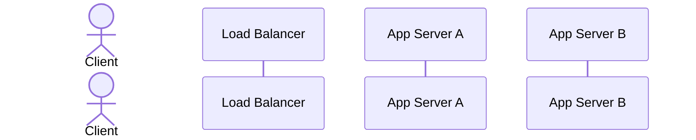

# 🧱 Component: Load Balancer

> **Scaffolded Jul 29, 2026 — lane ② (blocks & probes).** The cold hit from the Jul 26 rate-limiter
> mock. You fill this; filling it *is* the rep.

## 🎯 1-Sentence Metaphor
*

## 🧠 Underlying DSA Connection
* **Core Data Structure**:
* **Algorithmic Complexity**: pick-a-backend:
* **Data Flow Pattern**:

## 📋 Core Architectural Configurations

### 1. Where it sits (L4 vs L7)
* **L4 (transport)**:
* **L7 (application)**:
* **Which one can do the thing you need**:

### 2. Balancing algorithms
| Algorithm | How it picks | Assumption it makes | Where it breaks | Tradeoff |
|---|---|---|---|---|
| **Round robin** | picks sequentially around and around | assumes that all requests are the same size | breaks when one request hangs for a long time | |
| **Least connections** | it finds the server with the min open sockets | assumes that the smallest connections have the smallest loads | breaks when server A with many open connections but idle and server B with only a few open connections but overloaded due to workload. The algorithm here chooses B. | It also gives load balancer a state by adding a Counter to help it find the least connections |
| **IP hash** | | | | |
| **Consistent hashing** | | | | |

### 3. Sticky sessions
* **What it is**:
* **What it buys**:
* **What it costs**:

## 🔗 The rate-limit interaction (the reason this note exists)

You designed a per-instance in-memory rate-limit fallback for when Redis is down. Work out, for each
algorithm above, whether that fallback still holds:

| Algorithm | Do a user's requests land on one instance? | Is the per-instance fallback correct? | Effective limit vs intended |
|---|---|---|---|
| Round robin | | | |
| Least connections | | | |
| IP hash | | | |
| Consistent hashing | | | |
| Sticky sessions | | | |

* **Conclusion — what routing does the fallback actually require?**
* **And what does that requirement cost you elsewhere?**

## 🚨 Operational Bottlenecks & Failure Modes
* **Failure Mode 1**:
  * *Mitigation*:
* **Failure Mode 2**:
  * *Mitigation*:
* **The LB itself is a single point of failure** — how is it made not one?

## ⚖️ Decision Rationale
* **Choose this when**:
* **Prefer the alternative when**:
* **Key tradeoff accepted**:

## ❓ Likely Questions (rehearse the defense)
* "How do you detect a dead backend, and how fast?" →
* "A backend is slow but not dead. What happens?" →
* "You add a 4th server. How much traffic reshuffles under IP hash vs consistent hashing?" →
* "Your rate limiter counts per instance. Is your limit correct?" →

## 🗺️ Visual Architecture Flow

## 📇 Recall Card
> Blind-sprint prompts for the review rep — fill after the note is written.

1.
2.
3.
