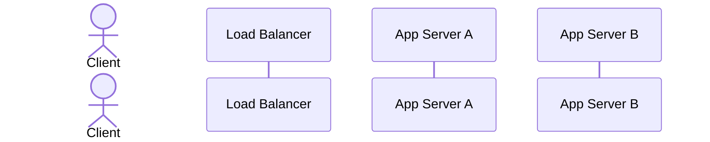

# 🧱 Component: Load Balancer

> **Scaffolded Jul 29, 2026 — lane ② (blocks & probes).** The cold hit from the Jul 26 rate-limiter
> mock. You fill this; filling it *is* the rep.
>
> **Restructured Jul 29** from a 5-column table into a ladder. The algorithms are mostly *successive
> repairs*, not parallel options — each one exists because the previous one broke. The `→ Which is why`
> line is the load-bearing part; a table had nowhere to put it.

## 🎯 1-Sentence Metaphor
*

## 🧠 Underlying DSA Connection
* **Core Data Structure**:
* **Algorithmic Complexity**: pick-a-backend:
* **Data Flow Pattern**:

## 📋 Core Architectural Configurations

### 1. Where it sits (L4 vs L7)
* **L4 (transport)**:
* **L7 (application)**:
* **Which one can do the thing you need**:

---

## 2. Balancing algorithms — the ladder

> Read top to bottom. Each one is a repair of the one above it, except IP hash, which
> solves a different problem entirely.

### Round robin
* **Picks by:** picks sequentially around and around
* **Assumes:** assumes that all requests are the same size
* **Breaks when:** breaks when one request hangs for a long time
* **Tradeoff:** holds no per-server state
  * *The sharpening:* it does keep a rotation index — but that's a fact about the LB's **own
    behaviour** ("I dealt to server 2 last") and cannot disagree with reality. Contrast with a
    connection count, which is a **claim about the world** and can go stale.
* **→ Which is why:** least connections exists.

### Least connections
* **Picks by:** it finds the server with the min open sockets
* **Assumes:** assumes that the smallest connections have the smallest loads
* **Breaks when:** breaks when server A with many open connections but idle and server B with only a
  few open connections but overloaded due to workload. The algorithm here chooses B.
  * *Second break — the stale counter:* a connection that dies without the LB observing it never gets
    decremented. That server's count sits permanently inflated, so it permanently loses the `min`
    comparison and is **starved of traffic while healthy and idle.**
* **Tradeoff:** It also gives load balancer a state by adding a Counter to help it find the least
  connections
* **→ Which is why:** *(does anything repair this one? or is the next algorithm answering a different
  question entirely?)*

### IP hash
* **Picks by:** picks the server based on the client hash, so same client always gets same server
* **Assumes:** assumes clients are uniform in number and weight
* **Breaks when:** breaks when we add a server and then the client loses what was in the RAM in their original server. We can also have key skew when the assumption breaks
* **Tradeoff:** does not check load on servers to get the same server guarantee
* **The different problem it solves:** guarantee same server per IP
* **→ Which is why:** consistent hashing exists.

**Banked from the Jul 29 session — the arithmetic that motivates the next rung:**

`hash(client_ip) % 3`, then add a fourth server so it becomes `% 4`. A client keeps its server only
when `h % 3 == h % 4`. Over the repeating period of 12:

| h | h%3 | h%4 | same? |
|---|---|---|---|
| 0 | 0 | 0 | ✓ |
| 1 | 1 | 1 | ✓ |
| 2 | 2 | 2 | ✓ |
| 3–11 | | | ✗ |

**3 of 12 keep their server → 75% of all clients get remapped** by adding one machine to a
three-server pool. Every one of them loses whatever was in local RAM.

**And the culprit is `% N`, not hashing.** The modulus bakes "how many servers exist" into every
key's destination, so changing N rewrites the whole mapping.

### Consistent hashing
> ⚠️ **Written up by the coach Jul 29, not learner-derived** — the ring rule and its consequence were
> supplied at the end of a session that overran badly. Treat every cell below as **taught, not tested.**
> The measurement is the rated blind sprint in the Aug 3 week, not the Jul 30 quiz.

* **Picks by:** hash the **servers** into the same fixed space as the clients (say 0–999), then a key
  goes to the **next server upward, wrapping** at the top. `% N` is gone — nothing counts the servers.
* **Assumes:** the servers' hashes land reasonably spread around the ring.
* **Breaks when:** that spread doesn't happen. With few servers, hashes clump by luck and the arcs come
  out wildly unequal — the server below a big gap owns a big share of the keyspace and becomes a hot
  spot. *(Fix: **virtual nodes** — hash each physical server to many points on the ring, e.g. 150
  each, so the arcs average out. Not covered Jul 29.)*
* **Tradeoff:** more machinery than `% N` — a sorted structure of ring positions and a successor
  lookup (binary search, `O(log N)`) instead of one modulo. You buy stability under membership change
  and pay in complexity. Still load-blind, exactly like IP hash.
* **What fraction of keys move when a server is added?** **~1/N**, and **exactly one existing server is
  affected** — the new node's successor, which gives up the arc between itself and the new node.
  Nobody else notices.

**The trace that produced that (servers 120 / 480 / 850, then add 700):**

| Server | Owns before | Owns after | Change |
|---|---|---|---|
| **120** | 851–999, 0–120 *(wraps)* | same | untouched |
| **480** | 121–480 | same | untouched |
| **700** | — | 481–700 | *new* |
| **850** | 481–850 | 701–850 | lost 481–700 |

**220 of 1000 keys move ≈ 22%** (against 1/4 = 25% expected for N=4) — versus **75%** under `% N`.

* **Why *next-upward* and not "closest"** *(learner's first instinct — deterministic and count-free, so
  it did meet the stated constraints)*: under next-upward a new node carves its arc out of **one**
  neighbour. Under closest it takes from **two**, and the clean one-neighbour bound disappears.

---

### 3. Sticky sessions
* **What it is**:
* **What it buys**:
* **What it costs**:

## 📊 Quick-reference (fill last — one line per cell, for scanning mid-interview)

| Algorithm | Picks by | Key weakness | Reach for it when |
|---|---|---|---|
| Round robin | | | |
| Least connections | | | |
| IP hash | | | |
| Consistent hashing | | | |

## 🔗 The rate-limit interaction (the reason this note exists)

You designed a per-instance in-memory rate-limit fallback for when Redis is down. Work out, for each
algorithm above, whether that fallback still holds:

| Algorithm | Do a user's requests land on one instance? | Is the per-instance fallback correct? | Effective limit vs intended |
|---|---|---|---|
| Round robin | | | |
| Least connections | | | |
| IP hash | | | |
| Consistent hashing | | | |
| Sticky sessions | | | |

* **Conclusion — what routing does the fallback actually require?**
* **And what does that requirement cost you elsewhere?**

## 🚨 Operational Bottlenecks & Failure Modes
* **Failure Mode 1**:
  * *Mitigation*:
* **Failure Mode 2**:
  * *Mitigation*:
* **The LB itself is a single point of failure** — how is it made not one?

## ⚖️ Decision Rationale
* **Choose this when**:
* **Prefer the alternative when**:
* **Key tradeoff accepted**:

## ❓ Likely Questions (rehearse the defense)
* "How do you detect a dead backend, and how fast?" →
* "A backend is slow but not dead. What happens?" →
* "You add a 4th server. How much traffic reshuffles under IP hash vs consistent hashing?" →
* "Your rate limiter counts per instance. Is your limit correct?" →

## 🗺️ Visual Architecture Flow

## 📇 Recall Card

> **Jul 30 quiz (10 min, UNRATED).** Answer cold, then unfold the note. This is consolidation the day
> after a teaching session — a rating here would measure recall of yesterday's conversation, not
> retention (§2a). The **rated** blind sprint is in the Aug 3 week, with a real forgetting gap.
> Cards 1–4 are learner-derived; 5–7 were supplied and are the ones most likely to have evaporated.

1. Round robin: what does it assume, and what's the one thing its state *cannot* get wrong?
2. Least connections: two separate ways it breaks. One is about cost-per-connection; what's the other?
3. Least connections picks server B with 5 busy sockets over server A with 50 idle ones. Why — and
   which is actually more loaded?
4. IP hash: what does it guarantee that neither algorithm above it can? And what did it stop doing to
   buy that?
5. `hash(ip) % 3` becomes `% 4`. What fraction of clients keep their server? *(number, not "most")*
6. State the ring rule in one sentence, without using the word "modulo."
7. Servers at 120 / 480 / 850; add one at 700. Which clients move, and **how many servers are
   affected**? Then: why next-upward rather than closest?

**Still unwritten in this note** — for the Aug 3 close-out, not the quiz: sticky sessions · the
rate-limit interaction table · L4 vs L7 · failure modes & the LB-as-SPOF · the metaphor · virtual nodes.
