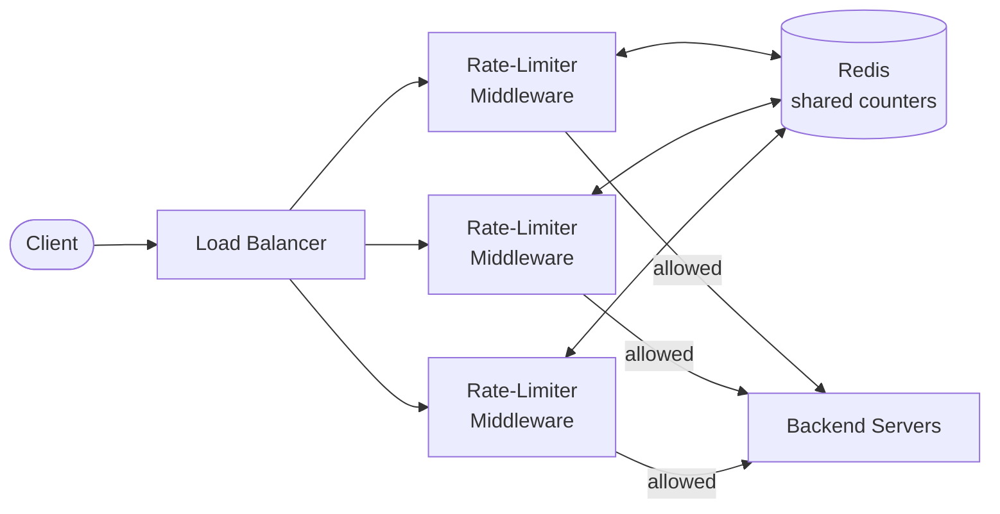
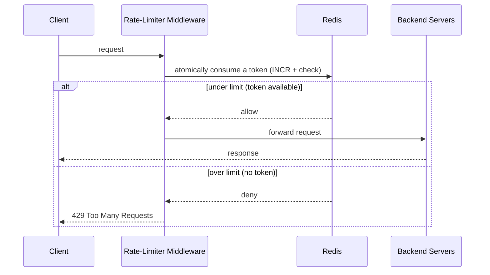

# Rate Limiter

> **Stage: Transition** ✅ (Bootstrap Jul 5 · Transition Jul 12 — sketched cold from memory, then diffed against this note). Next: **Mastery** — full ~45-min timed mock, self-scored.

## 🎯 Transition result — what came back cold, what didn't

**Recalled unprompted (the spine — all correct):** purpose (protect the backend), placement (middleware near auth), token bucket (N tokens + refill over time), Redis as the shared counter store, and the allow → forward / deny → block flow.

**Drill targets — these did NOT come back.** Each is a follow-up an interviewer actually pushes on:

| # | Gap | The thing to be able to say |
|---|-----|------------------------------|
| 1 | **Rules / policy component** | Named only 2 of the 3 core components. Missing: *what* limit, and *to whom* — per-user / per-IP / per-endpoint, tiered by plan. This is usually the **first clarifying question** in the interview. |
| 2 | **Why Redis (the real argument)** | Said "cache that consolidates requests" — undersells it. The actual reason: the middleware is **horizontally scaled**, each instance has its **own memory**, so a per-instance counter is bypassed by a user hitting different instances (3 instances → 3× the limit). Redis centralizes *mutable state*; it isn't caching. |
| 3 | **Atomicity** ⚠️ *biggest gap* | Never mentioned. Consume-and-check must be **one atomic read-modify-write** (`INCR` + check together), or two concurrent requests both read "1 token left" and **both pass**. This is the standard follow-up right after you say "Redis." |
| 4 | **TTL / expiry** | Redis TTL auto-resets the window / drives refill — no cleanup job. Cheap point, easy to bank. |
| 5 | **Reject semantics** | Said "blocks it." Name it: **`429 Too Many Requests`**, with `Retry-After`. |
| 6 | **A tradeoff, volunteered** | Accuracy vs performance: an exactly-accurate distributed counter needs synchronization that costs latency, so real systems accept small over-admission for speed. Offering a tradeoff *unprompted* is a strong signal. |

**Precision fix:** keep the division of labor crisp — **middleware = decision logic; Redis = shared state.** Redis doesn't "process the request and decide"; it atomically mutates a counter and returns the result.

**Read:** the *architecture* is internalized; the *depth layer* (atomicity, policy, failure/reject semantics, tradeoffs) is not. Normal for Transition — can draw the box diagram, can't yet defend it under questioning. Mastery drills exactly the six rows above.

---

## 🎯 In one line
Caps how many requests a user can make in a time window — to **protect the backend** from abuse, overload, and runaway cost. Over-limit requests are rejected *before* they reach the servers.

## 🏗️ Where it sits & what talks to what



Lives as **middleware** between client and servers, typically near where auth happens. (A *custom* algorithm can instead live inside a service — reasonable when you need app-specific logic.)

## 🧩 The 3 core components

| # | Component | Role |
|---|-----------|------|
| 1 | **Rules / policy** | What limit applies, and to whom (per-user / per-IP / per-endpoint) |
| 2 | **Counter store (Redis)** | The shared, fast state — how many requests / tokens each user has |
| 3 | **Algorithm + decision** | Token bucket (below) → allow or reject |

## 🔁 Request flow



The check is an **atomic read-modify-write** ("consume a token *and* check" in one step), so concurrent requests can't both slip through.

## 🪣 Token bucket (the standard algorithm)
A bucket holds up to `N` tokens and **refills over time** (e.g. +1/sec). Each request removes one token; no token → rejected.

```
[ 🪙🪙🪙🪙🪙 ]  ← bucket, capacity N, refills at a fixed rate
      │  each request consumes 1 token
      ▼
  token left? ──yes──► allow
      │
      └──no──► reject (429)
```
Bursts up to `N` are allowed; sustained rate is capped at the refill rate.

## 🧠 Why Redis (not the middleware's own memory)?
The middleware is **many identical instances** behind the load balancer, each with its *own* memory. A user hitting different instances would bypass a per-instance counter:

```
Instance A: {userX: 1}
Instance B: {userX: 1}   ← doesn't know A already counted → limit bypassed
Instance C: {userX: 1}
```

Redis is **one shared, in-memory store** all instances read/write, so the count is **global**. Chosen because it's:
- **Fast** (in-RAM → microseconds; hit on *every* request)
- **Atomic** (`INCR` avoids race conditions across concurrent requests)
- **Expiring** (TTL auto-resets windows / refills — no manual cleanup)

**Division of labor:** middleware = *logic* (allow/reject); Redis = *shared state* (the counts).

## ⚖️ Tradeoffs
- **Placement:** middleware (general, central) vs in-service (custom logic).
- **Accuracy vs performance:** a perfectly-accurate distributed counter needs synchronization that adds latency; real systems accept small inaccuracies for speed.

## 🔭 To deepen later (Transition/Mastery)
- Other algorithms: leaky bucket, fixed window, sliding-window log / counter.
- Distributed rate limiting details (sync, race conditions across the cluster).
- Reject UX: `429` + `Retry-After` header.
- Rule granularity: per-user vs per-IP vs per-endpoint, tiered limits.
