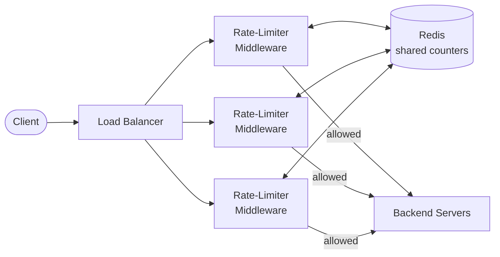
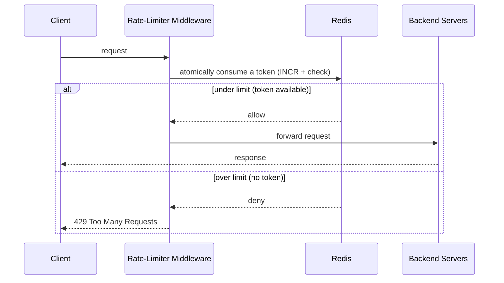

# Rate Limiter

> **Stage: Mastery attempted 🟡 — arc NOT closed** (Bootstrap Jul 5 ✅ · Transition Jul 12 ✅ · Mastery Jul 26 → 🟡). Next: **Mastery re-rep**, and per teach-then-measure it needs a **forgetting gap** — two mechanisms were taught mid-mock, so measuring them inside a few days measures the conversation, not retention. **Target: ~Aug 2–4.**

## 🎯 Mastery result (Jul 26) — read this before the re-rep

**Scenario used:** public client-facing REST API · 20k rps sustained / 50k peak · 2M API keys ·
tiers Free 100 / Paid 1000 / First-party 10000 req/min · one bulk-export endpoint costing **50×**
a normal request.

**Four of the six Transition targets came back COLD — genuine progress:**

| # | Target | Jul 26 |
|---|--------|--------|
| 1 | Rules / policy | ✅ Asked *"what are we limiting?"* and *"how many per key per minute?"* **unprompted** — the exact thing Transition missed first |
| 2 | Why Redis | ✅ Drew the instance fan-out → shared Redis before being asked; then reused the argument to insist the computation belongs in Redis, not the middleware |
| 4 | TTL / expiry | ✅ Raised idle-key expiry during *requirements*, unprompted |
| 5 | Reject semantics | 🟨 `429` named cold · **`Retry-After` still never surfaced** |
| 3 | **Atomicity** | ⚠️ **Half** — see below. Still the biggest gap |
| 6 | Volunteered tradeoff | ❌ Fail-open stated as a *rule*, not a tradeoff. Took a push + two hints to reach the qualified version |

### ⚠️ The atomicity gap, precisely — this is the thing to re-drill

Correct for the **simple counter**: Redis is single-threaded, so two `INCR`s serialize, and `INCR`
returns the **post-increment** value — so each caller decides on a number nobody else saw. The race
avoided is `GET`-then-`SET` as two round trips.

**Then the same claim was made for the token bucket, and it's false.** A token bucket needs
`read (tokens, last_refill_ts)` → `compute min(capacity, tokens + elapsed × rate)` → `conditionally
decrement` → `write back`. That's a multi-step read-modify-write with **your logic sitting between
two round trips**, and that gap is a race window. Two instances both read `tokens=1`, both compute
"a token is available," both allow.

> **The one-line version to have ready:** *Redis guarantees atomicity **per command**, not across
> commands. `INCR` was safe because the read and the modify happened **inside** one command.*

### 🆕 Taught Jul 26 — never encoded, so these are teaching not recall

- **`EVAL` / Lua scripting** — the fix for the above. Send Redis a Lua script; it runs the whole
  script on its single thread as **one command**, so read + math + clamp + conditional decrement +
  write-back become one indivisible operation in one round trip. `EVALSHA <sha1>` invokes a
  cached script by hash. ⚠️ The cache is **not durable** — restart / failover / `SCRIPT FLUSH`
  clears it and you get `NOSCRIPT`, so the pattern is *try `EVALSHA` → on `NOSCRIPT` fall back to
  `EVAL`*. Redis 7 `FUNCTION LOAD` makes it persistent. **Cost:** the script occupies the single
  thread and blocks every other client — keep it tiny and loop-free. Full card in
  [`../technologies/redis.md`](../technologies/redis.md).
- **Load-balancer routing strategies** — round robin · least connections · IP-hash / consistent
  hashing · sticky sessions. The last two pin a client to one instance, which breaks the degraded
  mode below. Owed a `components/load_balancer.md` note (lane ② pull queue).

### 🆕 Design answers reached this session (keep these)

- **Weighted tokens for expensive endpoints.** Pass `cost` as an `ARGV`; the bulk export costs 50
  tokens instead of 1. Free tier = **2 bulk exports/min**. ⚠️ The sufficiency check must scale too —
  `tokens >= cost`, not `tokens >= 1`, or a key on 10 tokens goes to −40.
- **Failure mode is not binary.** Fail-open vs fail-closed is a false choice; the answer is
  **degraded mode** — when Redis is unreachable each instance falls back to a **local in-memory
  bucket at `limit ÷ instance_count`** (10 instances, limit 100 → 10 each). Hard ceiling preserved,
  API stays up, zero coordination needed.
  - **Under round-robin this costs a well-behaved user nothing** — their 100 requests spread ~10 per
    instance, each exactly at its local limit.
  - **It degrades to a 10× under-admission** if the LB uses sticky or hash-based routing, which may
    already be configured for reasons unrelated to you. State it as a *dependency*, not a checkbox.
  - **It silently over-admits if you autoscale** — 10 → 20 instances doubles the effective global
    limit unless something updates the divisor.
  - Memory cost is bounded by keys **active during the outage**, not all 2M.

### ❌ Skipped entirely: the Scale step

"20k rps" went on the board and **nothing was computed from it** — not Redis ops/sec, not memory for
2M buckets, not what 50k peak means for one Redis instance. The framework is Requirements → **Scale**
→ High-level → Deep dive → Bottlenecks, and step 2 didn't happen. **Next rep: do the arithmetic out
loud before drawing anything.**

### 🔧 Correction to this note's own wording

The Transition "precision fix" below says *middleware = decision logic; Redis = shared state.* With a
Lua script **the token decision moves into Redis.** The middleware still owns what to do with the
verdict (forward vs reject) — but it is no longer the thing deciding whether a token was available.

---

## 🎯 Transition result (Jul 12) — what came back cold, what didn't

**Recalled unprompted (the spine — all correct):** purpose (protect the backend), placement (middleware near auth), token bucket (N tokens + refill over time), Redis as the shared counter store, and the allow → forward / deny → block flow.

**Drill targets — these did NOT come back.** Each is a follow-up an interviewer actually pushes on:

| # | Gap | The thing to be able to say |
|---|-----|------------------------------|
| 1 | **Rules / policy component** | Named only 2 of the 3 core components. Missing: *what* limit, and *to whom* — per-user / per-IP / per-endpoint, tiered by plan. This is usually the **first clarifying question** in the interview. |
| 2 | **Why Redis (the real argument)** | Said "cache that consolidates requests" — undersells it. The actual reason: the middleware is **horizontally scaled**, each instance has its **own memory**, so a per-instance counter is bypassed by a user hitting different instances (3 instances → 3× the limit). Redis centralizes *mutable state*; it isn't caching. |
| 3 | **Atomicity** ⚠️ *biggest gap* | Never mentioned. Consume-and-check must be **one atomic read-modify-write** (`INCR` + check together), or two concurrent requests both read "1 token left" and **both pass**. This is the standard follow-up right after you say "Redis." |
| 4 | **TTL / expiry** | Redis TTL auto-resets the window / drives refill — no cleanup job. Cheap point, easy to bank. |
| 5 | **Reject semantics** | Said "blocks it." Name it: **`429 Too Many Requests`**, with `Retry-After`. |
| 6 | **A tradeoff, volunteered** | Accuracy vs performance: an exactly-accurate distributed counter needs synchronization that costs latency, so real systems accept small over-admission for speed. Offering a tradeoff *unprompted* is a strong signal. |

**Precision fix:** keep the division of labor crisp — **middleware = decision logic; Redis = shared state.** Redis doesn't "process the request and decide"; it atomically mutates a counter and returns the result.

**Read:** the *architecture* is internalized; the *depth layer* (atomicity, policy, failure/reject semantics, tradeoffs) is not. Normal for Transition — can draw the box diagram, can't yet defend it under questioning. Mastery drills exactly the six rows above.

---

## 🎯 In one line
Caps how many requests a user can make in a time window — to **protect the backend** from abuse, overload, and runaway cost. Over-limit requests are rejected *before* they reach the servers.

## 🏗️ Where it sits & what talks to what


```mermaid
flowchart LR
    Client([Client]) --> LB[Load Balancer]
    LB --> M1[Rate-Limiter<br/>Middleware]
    LB --> M2[Rate-Limiter<br/>Middleware]
    LB --> M3[Rate-Limiter<br/>Middleware]
    M1 <--> R[(Redis<br/>shared counters)]
    M2 <--> R
    M3 <--> R
    M1 -->|allowed| S[Backend Servers]
    M2 -->|allowed| S
    M3 -->|allowed| S
```

Lives as **middleware** between client and servers, typically near where auth happens. (A *custom* algorithm can instead live inside a service — reasonable when you need app-specific logic.)

## 🧩 The 3 core components

| # | Component | Role |
|---|-----------|------|
| 1 | **Rules / policy** | What limit applies, and to whom (per-user / per-IP / per-endpoint) |
| 2 | **Counter store (Redis)** | The shared, fast state — how many requests / tokens each user has |
| 3 | **Algorithm + decision** | Token bucket (below) → allow or reject |

## 🔁 Request flow


```mermaid
sequenceDiagram
    participant C as Client
    participant M as Rate-Limiter Middleware
    participant R as Redis
    participant S as Backend Servers
    C->>M: request
    M->>R: atomically consume a token (INCR + check)
    alt under limit (token available)
        R-->>M: allow
        M->>S: forward request
        S-->>C: response
    else over limit (no token)
        R-->>M: deny
        M-->>C: 429 Too Many Requests
    end
```

The check is an **atomic read-modify-write** ("consume a token *and* check" in one step), so concurrent requests can't both slip through.

## 🪣 Token bucket (the standard algorithm)
A bucket holds up to `N` tokens and **refills over time** (e.g. +1/sec). Each request removes one token; no token → rejected.

```
[ 🪙🪙🪙🪙🪙 ]  ← bucket, capacity N, refills at a fixed rate
      │  each request consumes 1 token
      ▼
  token left? ──yes──► allow
      │
      └──no──► reject (429)
```
Bursts up to `N` are allowed; sustained rate is capped at the refill rate.

## 🧠 Why Redis (not the middleware's own memory)?
The middleware is **many identical instances** behind the load balancer, each with its *own* memory. A user hitting different instances would bypass a per-instance counter:

```
Instance A: {userX: 1}
Instance B: {userX: 1}   ← doesn't know A already counted → limit bypassed
Instance C: {userX: 1}
```

Redis is **one shared, in-memory store** all instances read/write, so the count is **global**. Chosen because it's:
- **Fast** (in-RAM → microseconds; hit on *every* request)
- **Atomic** (`INCR` avoids race conditions across concurrent requests)
- **Expiring** (TTL auto-resets windows / refills — no manual cleanup)

**Division of labor:** middleware = *logic* (allow/reject); Redis = *shared state* (the counts).

## ⚖️ Tradeoffs
- **Placement:** middleware (general, central) vs in-service (custom logic).
- **Accuracy vs performance:** a perfectly-accurate distributed counter needs synchronization that adds latency; real systems accept small inaccuracies for speed.

## 🔭 To deepen later
- ~~Distributed rate limiting details (sync, race conditions across the cluster)~~ — **done Jul 26**
  (Lua/`EVAL`, degraded mode). ~~Rule granularity / tiered limits~~ — **done Jul 26**.
- **Still open:** other algorithms — leaky bucket, fixed window, sliding-window log / counter.
  *Fixed window came up Jul 26 only as the contrast case (the 12:00:59 / 12:01:00 boundary burst:
  100 + 100 in two seconds, which token bucket smooths).* Sliding window is the usual follow-up when
  an interviewer says "token bucket allows bursts — what if I don't want that?"
- **Still open: `Retry-After`.** `429` is solid; the header has now been missed twice.
- **Still open: the scale arithmetic** — at 20k rps every request is one Redis round trip, so what
  does that mean for one Redis instance, and when do you need to shard? Do this cold next rep.
